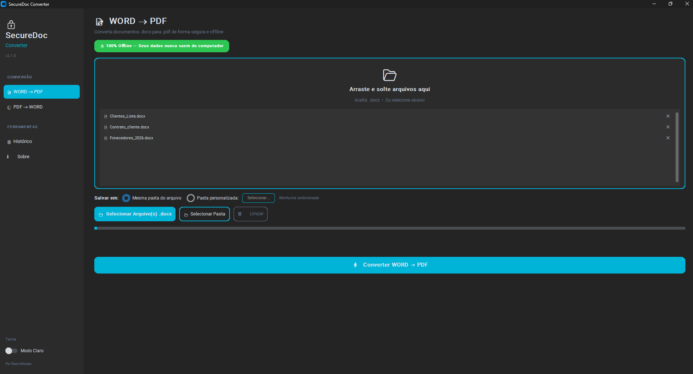
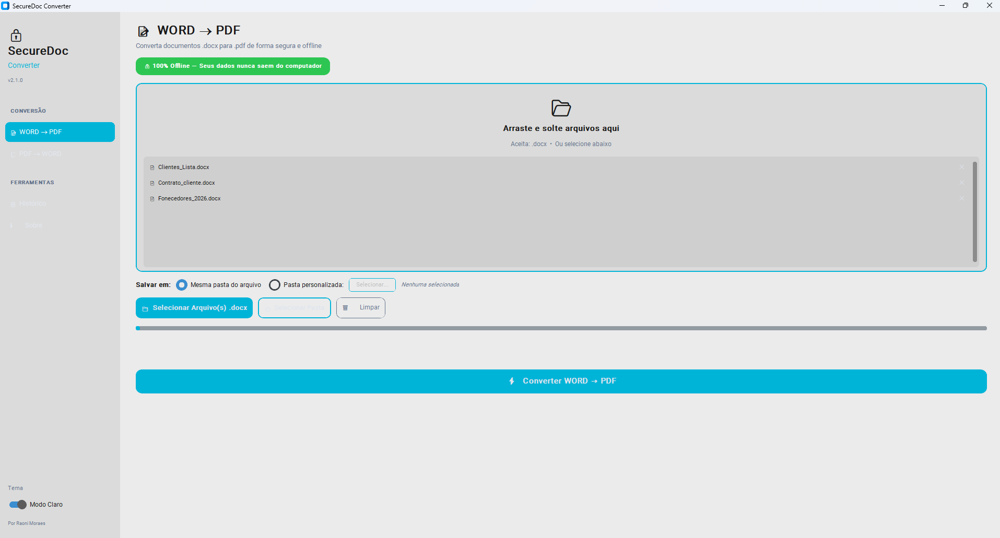

# 🔒 SecureDoc Converter

<div align="center">

**Conversor de documentos 100% offline e seguro.**
*Seus arquivos nunca saem do seu computador.*

[](https://python.org)
[](LICENSE)
[](https://www.microsoft.com/windows)

</div>

---

## 🎯 O Problema

Conversores online de documentos exigem que você **faça upload dos seus arquivos** para servidores desconhecidos. Você nunca tem certeza de:
- **Quem tem acesso** aos seus documentos
- **Se eles são armazenados** ou compartilhados
- **O que acontece** com suas informações pessoais

## ✅ A Solução

**SecureDoc Converter** é uma aplicação desktop que converte documentos entre **WORD (.docx)** e **PDF (.pdf)** de forma 100% local. Nenhum dado sai do seu computador.

---

## ⚡ Funcionalidades

| Feature | Descrição |
|---|---|
| 📝 **WORD → PDF** | Converta documentos `.docx` para `.pdf` |
| 📕 **PDF → WORD** | Converta documentos `.pdf` para `.docx` |
| 📂 **Drag & Drop** | Arraste e solte arquivos na janela |
| 📁 **Arquivo ou Pasta** | Converta arquivos individuais ou pastas inteiras |
| 📋 **Histórico Completo** | Log detalhado com data, hora, tipo e status |
| 🔒 **100% Offline** | Seus dados nunca saem do computador |
| 🎨 **Interface Moderna** | Design premium com tema claro/escuro |
| ⚡ **Multi-threading** | Interface fluida mesmo durante conversões |
| 📊 **Barra de Progresso** | Acompanhe o progresso em tempo real |

---

## 🖥️ Visual da Aplicação

<div align="center">

| Tema Escuro | Tema Claro |
| :---: | :---: |
|  |  |

</div>

---

## 🚀 Como Usar

### 💻 Para Usuários (Download Direto no Windows)
Se você quer apenas usar o programa sem precisar instalar o Python ou configurar códigos:

1. Acesse a seção de [**Releases**](https://github.com/rmoraes23/SecureDocConverter/releases) do repositório.
2. Baixe o arquivo executável mais recente: `SecureDocConverter.exe`.
3. Salve em qualquer pasta do seu computador e dê um **clique duplo** para abrir!

> [!NOTE]
> A conversão de **WORD ➔ PDF** requer que o Microsoft Word esteja instalado no seu Windows. Já a conversão de **PDF ➔ WORD** funciona de forma totalmente autônoma.

---

### 🛠️ Para Desenvolvedores (Rodando pelo Código-Fonte)
Se você quer rodar o projeto localmente em ambiente de desenvolvimento:

#### Pré-requisitos
- Python 3.10+ instalado.
- Microsoft Word instalado (necessário para docx2pdf).

#### Passos
```bash
# 1. Clone o repositório
git clone https://github.com/rmoraes23/SecureDocConverter.git
cd SecureDocConverter

# 2. Instale as dependências
pip install -r requirements.txt

# 3. Execute a aplicação
python main.py
```

#### 📦 Criando seu próprio Executável (.exe)
Para compilar o código fonte e gerar seu próprio executável do Windows:
```bash
python build.py
```
O arquivo `.exe` será gerado automaticamente dentro da pasta `dist/`.

---

## 📦 Dependências

| Pacote | Propósito |
|---|---|
| `customtkinter` | Interface moderna com temas |
| `docx2pdf` | Conversão WORD → PDF |
| `pdf2docx` | Conversão PDF → WORD |
| `Pillow` | Suporte a imagens na UI |
| `tkinterdnd2` | Drag & Drop de arquivos |

---

## 🏗️ Arquitetura

```
SecureDoc Converter/
├── main.py              # Aplicação principal (OOP)
├── build.py             # Script de compilação para executável
├── requirements.txt     # Dependências do projeto
├── conversor.log        # Histórico persistente de conversões
└── README.md            # Documentação
```

### Design Patterns
- **OOP**: Classe `SecureDocApp` encapsula toda a lógica
- **Threading**: Conversões rodam em background sem travar a UI
- **Observer Pattern**: Callbacks de progresso atualizam a interface em tempo real

---

## 🔐 Privacidade e Segurança

- ✅ **Zero upload** — Nenhum arquivo é enviado para servidores externos
- ✅ **Zero tracking** — Sem telemetria ou coleta de dados
- ✅ **Zero dependência de internet** — Funciona 100% offline
- ✅ **Código aberto** — Você pode auditar cada linha de código

---

## 🛠️ Tecnologias Utilizadas

- **Python 3.10+** — Linguagem principal
- **CustomTkinter** — Framework de UI moderna
- **docx2pdf** — Conversão WORD → PDF via COM automation
- **pdf2docx** — Conversão PDF → WORD com parsing local
- **Threading** — Processamento assíncrono

---

## 📄 Licença

Este projeto está sob a licença MIT. Veja o arquivo [LICENSE](LICENSE) para mais detalhes.

---

## 👤 Autor

**Raoni Moraes**

- GitHub: [@rmoraes23](https://github.com/rmoraes23)
- LinkedIn: [Raoni Moraes](https://linkedin.com/in/raonimoraes)

---

<div align="center">

*Desenvolvido com ❤️ por Raoni Moraes*

**⭐ Se este projeto te ajudou, considere dar uma estrela!**

</div>
